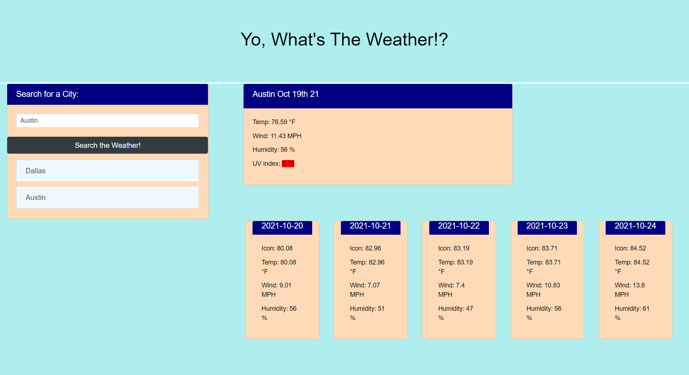

# Weather Tracker Dashboard

## License:

## Table of Contents
1. [Description](#description)

2. [Installation](#installation)

3. [Usage](#usage)

4. [Testing](#testing)

5. [Contribution](#contribution)

6. [Questions](#questions)

## Description 
This project was built to check the current and future weather conditions of various cities in the United States. It utilizes Javascript and Local Storage to dynamically change the HTML website. Each search presents the user with the date, temperature, wind, humidity, and UV conditions.

## Installation 
This project requires users to visit www.openweathermap.org/api and sign up for their personal API key. The API key variable under the assets/javascript.js file should match the respective developer's API key. Other than that, the application is ready for deployment.

## Usage 
Live Website: https://alexisgonzalez07.github.io/WeatherTrackerDashboard/

This product can be used as a reference for API development for beginner devs. Currently, this is an incomplete product and ideally, it would be bundled with another project, such as a travel companion or trip planner.

## Testing 
This application has no tests.

## Contribution 
This project's code for handling local storage is incomplete, so any input or suggestions will be reviewed and implemented if appropriate. However, this project's lifecycle will come to a close at the end of 2021.

## Questions 
Feel free to email me at: alexis.gonzalez07@gmail.com

Visit my Github profile at: [Alex Gonzalez Github](https://www.github.com/AlexisGonzalez07)